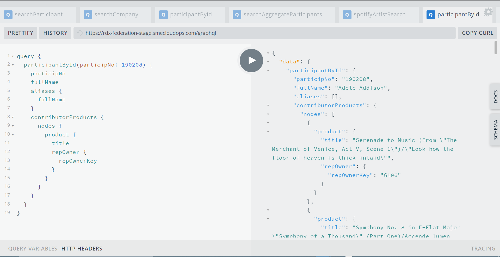

### Authenticating with GraphQL
The SME Federation GraphQL Gateway implements the USM Authentication process requiring users to acquire an OAuth2 
token to access the Gateway and the backend services.  The Gateway offers two endpoints to authenticate and acquire 
an OAuth2 token.

* [ID Token Request](https://rdx-federation-stage.smecloudops.com/usm-auth) redirects the user to the USM 
  Authentication page enabling the user to authenticate and acquire an OAuth2 token.


* [Playground Authentication](https://rdx-federation-stage.smecloudops.com/usm-graphql-auth) redirects the user to 
  the USM Authentication page enabling the suer to authenticate and access the SME GraphQL Playground.

#### Using the ID Token
Use the `id_token` to execute graphql requests directly against the SME Federation Gateway 
[endpoint](https://rdx-federation-stage.smecloudops.com).  Simply add the 
`id_token` as a query parameter on the graphql `post` request.

```shell
https://rdx-federation-stage.smecloudops.com?id_token=<usm provided token>
```

#### Using the GraphQL Playground
After successful authentication, the user is redirected to the SME Federation GraphQL Playground where they can 
interactively execute queries, review the Federation schema and related documentation.

To learn more about using the Apollo GraphQL Playground, refer to [Build and Run Queries using the Apollo GraphQL Playground](https://www.apollographql.com/docs/apollo-server/testing/build-run-queries/)



### Further reading

There is a _lot_ more you can do when forming GraphQL calls. Here are some places to look next:

* [Pagination](https://graphql.github.io/learn/pagination/)
* [Fragments](https://graphql.github.io/learn/queries/#fragments)
* [Inline fragments](https://graphql.github.io/learn/queries/#inline-fragments)
* [Directives](https://graphql.github.io/learn/queries/#directives)
